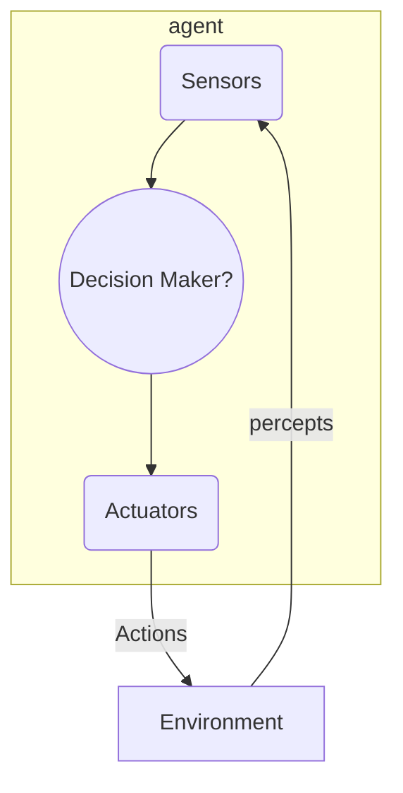

# intro to AI

## AI -> Computational Rationality

Being rational means **maximizing your expected utility**

for brains:

- rational but not perfect
- hard to reverse engineer
- **memory and simulation** are the keys to decision-making

## Brief History

- Early days
- Knowledge-based approaches
  - failed (impossible to know all the rules in the world)
- Statistical approaches
  - resurgence of probability, focus on uncertainty
- Big data, big compute, neural networks (Now?)
  - NLP (Natural Language Processing)
  - Computer Vision

> AI can't write intentially funny stories? idk, maybe chat can (but **why** ?)

## Course Topics

- Part 1: Intelligence from Computation
  - Fast search/planning
  - Constraint satisfaction (e.g. scheduling)
  - Adversarial and uncertain search (e.g. routing, navigation)
- Part 2: Intelligence from Data
  - Probabilistic inference with Bayes’ nets (e.g. robot localization)
  - Decision theory
  - Supervised machine learning (e.g. spam detection)
- Throughout: Applications
  - Natural language, vision, robotics, games, etc.

> not pure CS, not pure ML, more math, more general

## Designing Rational Agents

- Agent: an entity that perceives and acts

- Project: Pacman

### Agents that Plan Ahead

- **reflex agents**: based on precept (maybe memory)
  - do not consider the consequence
  - Consider how the world **IS**
- **planning agent**: Decisions based on (hypothesized) consequences of action
  - Must have a model of how the world evolves in response to actions
  - Must formulate a goal (test)
  - Consider how the world **WOULD BE**
  - planning algorithm
    - optimal: find the best solution
    - complete: find one solution
  - replanning: action -> feedback -> new methods -> action ...

### Search Problems

- **search problems** consist of
  - state space ("model of the world") (state space size)
  - successor function (action & cost)
  - start state and goal test
- **solution**: a sequence of actions (a plan) that transforms the start state into a goal state.

### Uninformed Search Methods

- Depth-First Search
- Breadth-First Search
- Uniform-Cost Search
