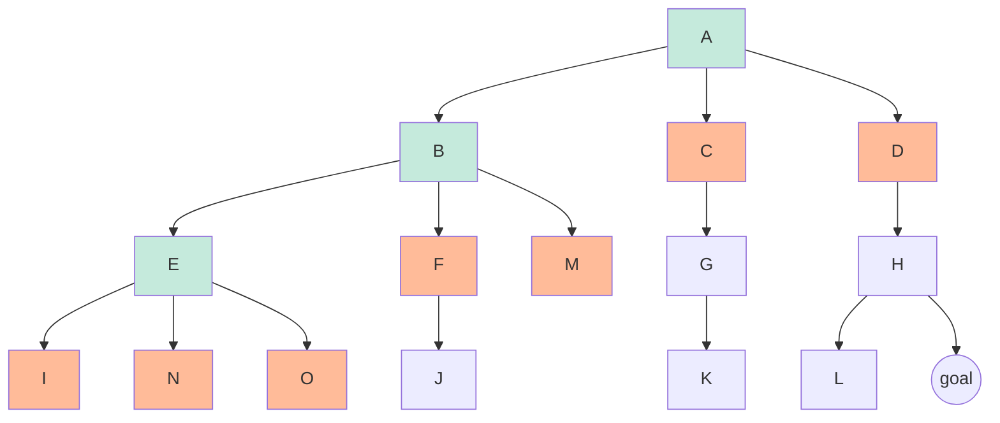

# Search Problems

- **search problems** consist of
  - **state space** ("model of the world") (state space **size**: possibilities)
    - world state: every last detail
    - **search state**: keeps only the details needed for planning
  - successor function (action & cost)
  - start state and goal test
- **solution**: a sequence of actions (a plan) that transforms the start state into a goal state.
  - math representation: **state space graph**
    - Nodes are (abstracted) world configurations
    - Arcs represent successors (results of actions)
    - The goal test is a set of goal nodes (maybe only one)
  - **search tree**
    - A “what if” tree of plans and their outcomes
    - The start state is the root node corresponding to the successors
    - Nodes show states but correspond to PLANS that achieve those states
    - for most problems, we can never actually build the whole tree (too big!) (so it's built little by little, till the goal is found)

Pseudocode for **tree search**:
```
function TREE-SEARCH(problem, frontier) return a solution or failure
    frontier← INSERT(MAKE-NODE(INITIAL-STATE[problem]), frontier)
    while not IS-EMPTY(frontier) do
        node ← POP(frontier)
        if problem.IS-GOAL(node.STATE) then return node
        end if
        for each child-node in EXPAND(problem, node) do
            add child-node to frontier
        end for
    end while
    
    return failure

function EXPAND(problem, node) yields nodes 
    s← node.STATE
    for each action in problem.ACTIONS(s) do
        s′ ← problem.RESULT(s, action)
        yield NODE(STATE=s′, PARENT=node, ACTION=action)
    end for
//EXPAND returns all the possible nodes that can be reached from a given node by considering all available actions.
```
**All these search algorithms are the same except for fringe strategies**

## Uninformed Search Methods
When we *have no knowledge of the location of goal states in our search tree*, we are forced to select our strategy for tree search from one of the techniques that fall under the umbrella of uninformed search.

Search Properties:
- **completeness**: there *exists* a solution to the search problem, is the strategy guaranteed to find it given infinite computational resources?
- **optimality**: the strategy guaranteed to find the *lowest cost* path to a goal state?
- **branching factor** `b`: the increase in the number of nodes on the frontier each time a frontier node is dequeued and replaced with its children is O(b). At depth k in the search tree, there exist $O(b^k)$ nodes.
- **the maximum depth** `m` (could be infinite when there's a loop in the state space graph)
- the depth of the shallowest solution `s`
- **Time complexity**: The time complexity of an algorithm quantifies the amount of time taken by an algorithm to run as a function of the length of the input.
- **Space complexity**: Problem-solving using a computer requires memory to hold temporary data or final result while the program is in execution.[\ref](https://www.geeksforgeeks.org/time-complexity-and-space-complexity/) 

### Depth-First Search
[visual](https://visualgo.net/en/dfsbfs)
| completeness | optimality | time complexity | space complexity |
|--------------|------------|-----------------|-------------------|
| only if `m` is finite, so only if we prevent cycle | No, it finds the leftmost solution | $O(b^m)$ | $O(b \cdot m)$ |

> why SC = $O(b \cdot m)$ :
> need to store the frontier/fringe nodes, and in the worst case:
> there are $b+(b-1)(m-1)=O(b \cdot m)$ nodes in the frontier (the orange nodes in the following tree)


### Breadth-First Search
| completeness | optimality | time complexity | space complexcity |
|--------------|------------|-----------------|-------------------|
| yes (`s` must be finite as long as solution exists) | Only if all **cost**s are 1 | $O(b^s)$ | $O(b^s)$ |
`s` is the depth of the solution
---

#### about BFS & DFS
- BFS outperforms DFS:
  - knowing that solutions are shallow
  - there're cycles
- DFS outperforms BFS:
  - knowing that solutions are deep
  - solution close to the LHS(or RHS, just search from right)
  - storage limited

> **conbining DFS and BFS?**
> run DFS with depth limit `i`, if no solution => `i += d`
> repeat some steps, seem rebundant, but the repeated steps are shallow and therefore small
---
> All search algorithms (DFS, BFS, etc) are fundamentally the same - they explore nodes on a search frontier (also called a fringe). The only difference is how nodes are prioritized on the fringe(i.e. [priority queue](#search-problems)). This allows algorithms like A* to prioritize nodes.
> However, for simpler algorithms like DFS and BFS, the priority queue abstraction is unnecessary. DFS just needs a stack, while BFS only needs a standard queue.
> Using a [stack/queue](https://realpython.com/queue-in-python/#learning-about-the-types-of-queues) avoids the O(log n) cost of typical priority queue operations like insertion and deletion. For DFS/BFS the amortized cost is O(1).


### Uniform-Cost Search
> when not all **cost**s are equal, BFS doesn't guarantee the optimality

Processes all the nodes cost less than the cheapest solution.(low-cost first)
If that solution costs $C^*$ and arcs cost at least $\epsilon$, then the “effective depth” is roughly $\frac{C^*}{\epsilon}$

| completeness | optimality | time complexity | space complexity |
|--------------|------------|-----------------|-------------------|
| yes (Assuming $C^*$ finite and $\epsilon>0$) | yes (prooved in the next lecture) | $O(b^{\frac{C^*}{\epsilon}})$ | $O(b^{\frac{C^*}{\epsilon}})$ |

> the bad:
> - Explores options in every “direction”
> - No information about goal location
> 
> However, they will be fix soon!

#### Dijkstra's algorithm [\ref](https://stackabuse.com/courses/graphs-in-python-theory-and-implementation/lessons/dijkstras-algorithm/)
The relationship between DA and UCS? [\ref](https://stackoverflow.com/questions/12806452/whats-the-difference-between-uniform-cost-search-and-dijkstras-algorithm)

> The two-point shortest-path algorithm of Dijkstra (1959) is the origin of uniform-cost search. These works also introduced the idea of explored and frontier sets (closed and open lists). --Artificial Intelligence: A Modern Approach (3rd edition)
- the similarity: [\ref1](https://ai.stackexchange.com/questions/24668/what-is-the-difference-between-the-uniform-cost-search-and-dijkstras-algorithm) [\ref2](https://cdn.aaai.org/ojs/18191/18191-77-21707-1-2-20210717.pdf)
- the difference:
  - Dijkstra's Algorithm finds the shortest path from the root node to **every other node**. uniform cost searches for the shortest paths in terms of cost from the root node to **a goal node**. Uniform Cost Search is Dijkstra's Algorithm which is focused on finding a single shortest path to a single finishing point rather than the shortest path to every point.
  - UCS does this by stopping as soon as the finishing point is found. For Dijkstra, there is no goal state and processing continues until all nodes have been removed from the priority queue, i.e. until the shortest paths to all nodes (not just a goal node) have been determined.
  - UCS has **fewer space requirements**, where the priority queue is filled gradually as opposed to Dijkstra's, which adds all nodes to the queue at the start with an infinite cost.
  - As a result of the above points, UCS is **less time-consuming** than Dijkstra 
  - UCS is usually formulated on **trees** while Dijkstra is used on **general graphs**
  - Djikstra is only applicable in **explicit graphs** where the entire graph is given as input. UCS starts with the source vertex and **gradually traverses** the necessary parts of the graph. Therefore, it is applicable for both explicit graphs and implicit graphs (where states/nodes are generated).

## Informed Search Methods

**Heuristics**: a function estimating how close a state is to a goal
- Heuristics are typically solutions to **relaxed problems** (where some of the constraints of the original problem have been removed) 
- designed for a particular search problem
  - e.g. a common heuristic used to solve the Pacman pathing problem is  **Manhattan distance**: $\Delta x + \Delta y$ (since you can only go straight in Pacman)
  - for the pancakes, a heuristic is the number of larger pancakes out of place

### Greedy Search
choosing the node "closest" to the goal (Greedy want it NOW, commonly Best-first takes you straight to the (wrong) goal)
> **Greedy vs UCS** Greedy search operates identically to UCS, with a priority queue Frontier Representation. The difference is that instead of using computed backward cost (the sum of edge weights in the path to the state) to assign priority, greedy search uses estimated forward cost in the form of heuristic values.

| completeness | optimality | time complexity | space complexity |
|--------------|------------|-----------------|-------------------|
| no | no | $O(b^m)$ | $O(b^m)$ |

> - The time complexity of greedy search is O(b^m) (almost the whole tree) 
>   - Greedy algorithms are often faster than dynamic programming/backtracking due to their greedy heuristic choices.
>   - But they may not always find the optimal solution.
>   - Time complexity depends on specific operations like sorting, searching used in the algorithm.
> - The space complexity of greedy search is also O(b^m). This is because we need to store the heuristic function evaluations for all nodes during the traversal. In the worst-case scenario, almost the whole tree needs to be remembered 1.

### $A^*$ Search
- $A^*$ Search is a strategy for exploration that always selects the frontier node with the lowest estimated total cost for expansion, where the total cost is the entire cost from the start node to the goal node, like a **combination of Greedy and UCS**: ordering the priority queue by $f(n) = g(n) + h(n)$
  - Uniform-cost orders by path cost, or *backward cost* $g(n)$
  - Greedy orders by goal proximity, or *forward cost* $h(n)$
- **Admissible Heuristics**
  - h is admissible (optimistic) if: $\forall n, 0 ≤ h(n) ≤ h^∗(n)$, where $h^∗(n)$ is the true cost to a nearest goal
  - Why should h be admissible? We need estimates to be less than the actual costs so that $A^*$ Search is optimal. (more UCS less Greedy so we can have completeness and optimality)

| completeness | optimality | time complexity | space complexity |
|--------------|------------|-----------------|-------------------|
| yes | yes | $O(b^m)$ | $O(b^m)$ |

#### Proof of the **Optimality** of $A^*$ Search

[\ref](https://inst.eecs.berkeley.edu/~cs188/fa22/assets/notes/cs188-fa22-note02.pdf)
- **Consistency** : 
  - to maintain optimality under A* **graph search**, we need an even stronger property than admissibility, **consistency**
  - enforce not only that a heuristic underestimates the total distance to a goal from any given node, but also the cost/weight of each edge in the graph, mathematically, $\forall A, C \quad h(A) − h(C) ≤ cost(A, C)$ where A, C are two connected nodes.