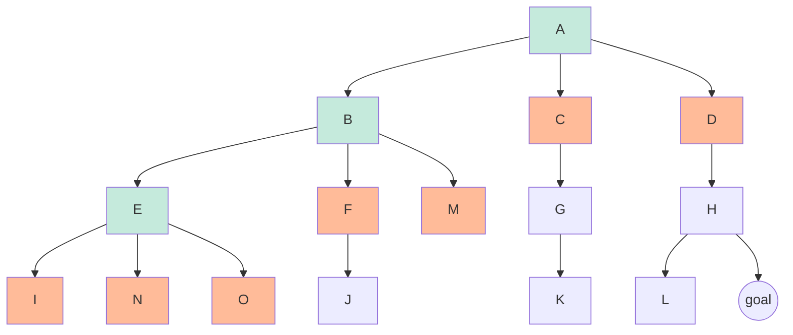

# Search Problems

- **search problems** consist of
  - **state space** ("model of the world") (state space **size**: possibilities)
    - world state: every last detail
    - **search state**: keeps only the details needed for planning
  - successor function (action & cost)
  - start state and goal test
- **solution**: a sequence of actions (a plan) that transforms the start state into a goal state.
  - math representation: **state space graph**
    - Nodes are (abstracted) world configurations
    - Arcs represent successors (results of actions)
    - The goal test is a set of goal nodes (maybe only one)
  - **search tree**
    - A “what if” tree of plans and their outcomes
    - The start state is the root node corresponding to the successors
    - Nodes show states but correspond to PLANS that achieve those states
    - for most problems, we can never actually build the whole tree (too big!) (so it's built little by little, till the goal is found)

Pseudocode for **tree search**:
```
function TREE-SEARCH(problem, frontier) return a solution or failure
    frontier← INSERT(MAKE-NODE(INITIAL-STATE[problem]), frontier)
    while not IS-EMPTY(frontier) do
        node ← POP(frontier)
        if problem.IS-GOAL(node.STATE) then return node
        end if
        for each child-node in EXPAND(problem, node) do
            add child-node to frontier
        end for
    end while
    
    return failure

function EXPAND(problem, node) yields nodes 
    s← node.STATE
    for each action in problem.ACTIONS(s) do
        s′ ← problem.RESULT(s, action)
        yield NODE(STATE=s′, PARENT=node, ACTION=action)
    end for
//EXPAND returns all the possible nodes that can be reached from a given node by considering all available actions.
```
**All these search algorithms are the same except for fringe strategies**

## Uninformed Search Methods
When we *have no knowledge of the location of goal states in our search tree*, we are forced to select our strategy for tree search from one of the techniques that falls under the umbrella of uninformed search.

Search Properties:
- **completeness**: there *exists* a solution to the search problem, is the strategy guaranteed to find it given infinite computational resources?
- **optimality**: the strategy guaranteed to find the *lowest cost* path to a goal state?
- **branching factor** `b`: the increase in the number of nodes on the frontier each time a frontier node is dequeued and replaced with its children is O(b). At depth k in the search tree, there exist $O(b^k)$ nodes.
- **the maximum depth** `m` (could be infinite when there's a loop in the state space graph)
- the depth of the shallowest solution `s`
- **Time complexity**: The time complexity of an algorithm quantifies the amount of time taken by an algorithm to run as a function of the length of the input. \[ref](https://www.geeksforgeeks.org/time-complexity-and-space-complexity/) 
- **Space complexity**: Problem-solving using a computer requires memory to hold temporary data or final result while the program is in execution.

### Depth-First Search
| completeness | optimality | time complexity | space complexcity |
|--------------|------------|-----------------|-------------------|
| only if `m` is finite, so only if we prevent cycle | No, it finds the leftmost solution | $O(b^m)$ | $O(b \cdot m)$ |

> why SC = $O(b \cdot m)$ :
> need to store the frontier/fringe nodes, and in the worst case:
> there are $b+(b-1)(m-1)=O(b \cdot m)$ nodes in the frontier (the orange nodes in the following tree)


### Breadth-First Search
| completeness | optimality | time complexity | space complexcity |
|--------------|------------|-----------------|-------------------|
| yes (`s` must be finite as long as solution exists) | Only if all **cost**s are 1 | $O(b^s)$ | $O(b^s)$ |
> `s` is the depth of the solution

- BFS outperform DFS:
  - knowing soltions are shallow
  - there're cycles
- DFS outperform BFS:
  - knowing soltions are deep
  - solution close to the LHS(or RHS, just search from right)
  - storage limited

> conbining DFS and BFS?
> run DFS with depth limit `i`, if no solution => `i += d`

### Uniform-Cost Search
> when not all **cost**s are equal, BFS doesn't guarantee the optimality

Processes all the nodes cost less than the cheapest solution.(low-cost first)
If that solution costs $C^*$ and arcs cost at least $\epsilon$, then the “effective depth” is roughly $\frac{C^*}{\epsilon}$

| completeness | optimality | time complexity | space complexcity |
|--------------|------------|-----------------|-------------------|
| yes (Assuming $C^*$ finite and $\epsilon>0$) | yes (prooved in the next lecture) | $O(b^{\frac{C^*}{\epsilon}})$ | $O(b^{\frac{C^*}{\epsilon}})$ |

> the bad:
> - Explores options in every “direction”
> - No information about goal location
> 
> However, they will be fix soon!